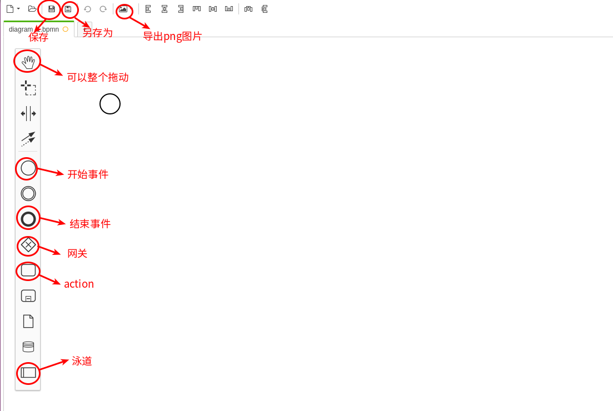
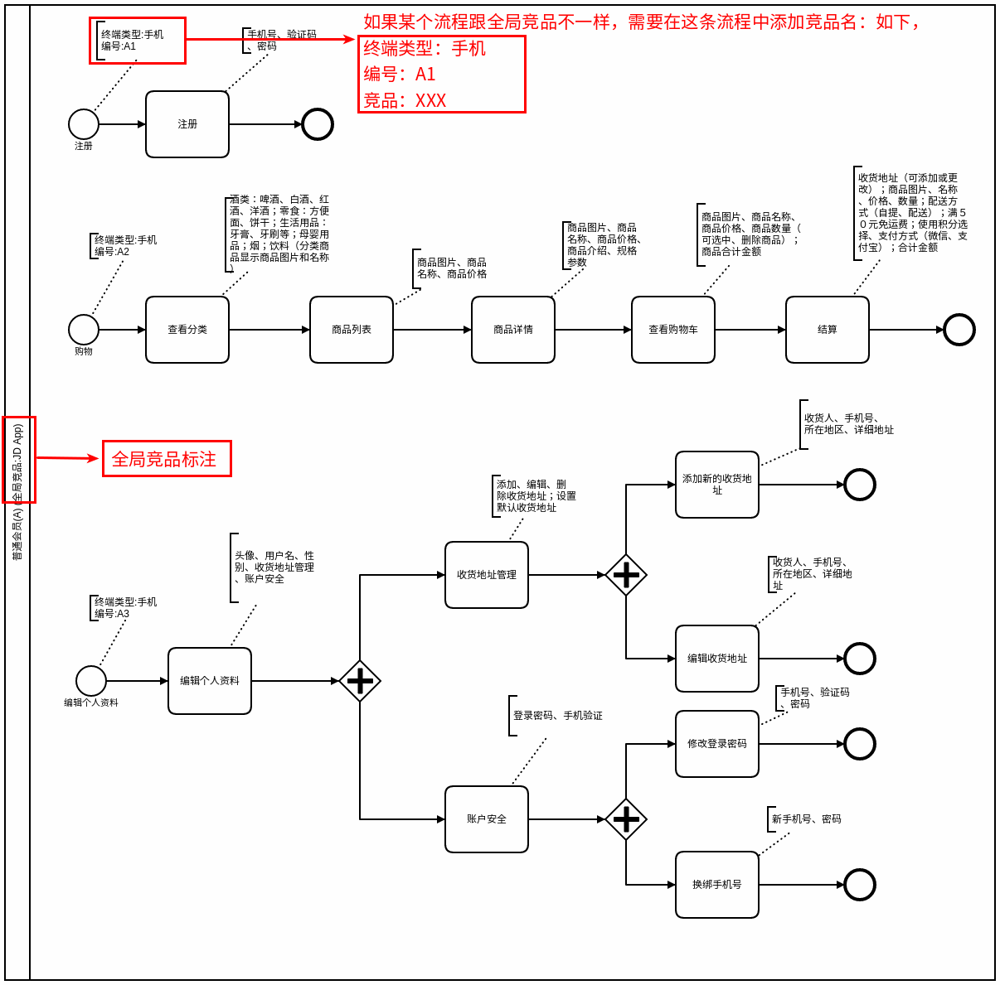

# 画流程图工具Camunda Modeler的使用方法及其规范
## 一、画流程图工具camunda的使用方法以及流程图规范： 所有用户角色都画在一个bpmn文件里

1. 如果未安装此工具，请查看官网 [Camunda](https://camunda.com/download/modeler/) 下载安装
 
2. 已经安装成功后，请点击图标打开工具，点击创建新的BPMN文件
   
   

3. 创建完成新的文件后，进入画流程图界面，先了解一下界面上几个重要的功能按钮

   

4. 接下来是具体操作的部分，按照**流程图规范**，我们需要标注如下几点：用户角色名称、编号、竞品；每个开始事件的终端类型、编号和竞品名；每个操作都要标注好对应的信息点。 
   
   - 用户角色
        
        流程图中的泳道（最左侧标注了文字的格子）表明了在整个业务流程中，都有哪些用户角色参与。

   - 使用场景
  
        一般由事件（圆圈表示）引发出来的一段流程，被称为使用场景，或者说用户的动机/目的。使用场景对应了某个入口页， 入口页一定是由某一个使用场景引发的，查看 [什么是入口页](http://www.wware.org/op/yhdr.html) 

   - 动作

        用户为了达成目标，需要在产品上一步一步怎么操作，这个就是动作（用方框表示）。

   - 信息点
  
        用户在操作每一个动作时，都需要填写或查看相应的信息，这就是每个具体步骤中的信息点（放在方框上面，用一个中括号表示）。

   如下图所示：

   

5. 画完流程图后，点击左上角的另存为保存成xxx.bpmn格式，然后还可以再点击左上角的导出为不同格式的图片，具体操作如下图

   

6. 如果想再次编辑保存过的bpmn文件，可以点击左上角的第二个图标，选择文件打开就可以编辑，编辑过程中随时保存，以免修改的数据丢失。如图所示

   
   

   