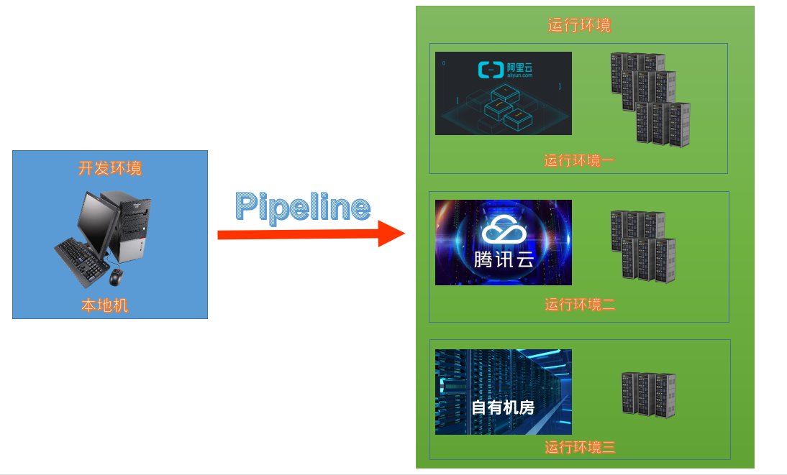

<h1>环境安装</h1> 

<h1>目录</h1>

- [环境说明](#环境说明)
  - [开发环境](#开发环境)
  - [运行环境](#运行环境)
- [环境安装说明](#环境安装说明)
  - [Linux环境安装](#linux环境安装)
    - [Linux开发环境安装依赖](#linux开发环境安装依赖)
    - [Linux运行环境安装：](#linux运行环境安装)
    - [Linux测试运行环境](#linux测试运行环境)
    - [Linux开发环境安装过程可能存在的报错信息](#linux开发环境安装过程可能存在的报错信息)
  - [Windows环境安装](#windows环境安装)
    - [Windows开发环境安装依赖](#windows开发环境安装依赖)
  - [Mac OS环境安装](#mac-os环境安装)


# 环境说明

<h3>环境分为开发环境和运行环境；</h3>

## 开发环境
&emsp;&emsp;让你的项目在你本机上运行起来的环境，我们称为开发环境，这种环境有个特殊之处，他的目的是让你在本地能够更好的开发，他是协助你开发的，而不是协助你运行的，开发环境使用上和运行环境无缝衔接，也就是，不做任何修改能部署到运行环境上去。开发环境安装完成就绪以后，你的其他运行环境是由在你开发环境下执行pipeline，部署上去，一个项目会需要若干进程、若干服务彼此依赖。有些是外部服务，有些是自己的服务，那么自己开发的服务，我们都是以`$`美元符号为开头命名的，是项目本身代码生成的服务，例如`$webapi`指的api服务，`$webass`指定了静态资源的服务，`$webmob` 是手机版的服务，现阶段你只需要知道如何把本地环境装上，然后在开发环境下执行pipeline了，开发环境也可以称为自举环境，如果在开发环境修改代码，执行pipeline指定参数，就能够部署到项目中。

## 运行环境
&emsp;&emsp;运行环境就是真正为用户提供服务的环境，通常是运行在云上，比如阿里云、腾讯云、百度云或者自己托管的主机上。我们目前的运行环境只支持Linux环境及其衍生版。在你本机开发环境就绪以后可以通过pipeline快速部署。



# 环境安装说明

## Linux环境安装

（***说明：ubuntu最低版本要求20.04***）

### Linux开发环境安装依赖

1. 安装 `node`
 
    使用命令行安装依次执行 

    安装依赖软件 `sudo apt install curl git vim make g++ -y`
    
    安装nvm
    ```
    curl -o- https://ghproxy.com/https://raw.githubusercontent.com/nvm-sh/nvm/v0.39.2/install.sh | bash
    ```

    安装node最新版本 `nvm install --lts`
    
    设置全局node
    ```
    sudo ln -s "$NVM_DIR/versions/node/$(nvm version)/bin/node" "/usr/local/bin/node"
    sudo ln -s "$NVM_DIR/versions/node/$(nvm version)/bin/npm" "/usr/local/bin/npm"
    ```

    切换npm源为国内源 `npm config set registry https://registry.npmmirror.com`
 
    测试node是否安装

    打开终端(快捷键ctrl+alt+T)，分别输入下面两个命令：

    > node -v 

    > npm -v

    如果均正确输出版本号，则证明node已安装；


2. 安装 `gulp`

   使用命令安装gulp `sudo npm install -g gulp-cli` 
   
   测试gulp是否安装

    打开终端(快捷键ctrl+alt+T)，分别输入下面的命令：
    
   > gulp -v

   如果均正确输出版本号，则证明gulp已安装；


3. 安装 `yarn`

   方法一（推荐）:

   一种跨平台安装方式，直接执行一个命令来安装

   `npm install -g yarn`

   方法二：

    导入软件源的 GPG key 并且添加 Yarn APT 软件源到你的系统，运行下面的命令：

    `curl -sS https://dl.yarnpkg.com/debian/pubkey.gpg | sudo apt-key add -`

    `echo "deb https://dl.yarnpkg.com/debian/ stable main" | sudo tee /etc/apt/sources.list.d/yarn.list`

    一旦软件源被启用，升级软件包列表，并且安装 Yarn

    `sudo apt update`

    `sudo apt install yarn`

    上面的命令同时会安装 Node.js。如果你已经通过 nvm 安装了 Node，跳过 Node.js 安装过程：

    `sudo apt install --no-install-recommends yarn`

    测试yarn是否安装

     > yarn -v

     如果均正确输出版本号，则证明yarn已安装；

4. 安装 `docker`

   使用命令安装依次docker 
   安装依赖软件 `sudo apt install apt-transport-https ca-certificates curl gnupg-agent software-properties-common`

   添加软件源的GPG秘钥 `curl -fsSL https://download.docker.com/linux/ubuntu/gpg | sudo apt-key add -`

   添加docker软件源 `sudo add-apt-repository "deb [arch=amd64] https://download.docker.com/linux/ubuntu $(lsb_release -cs) stable"`

   更新apt软件包缓存 `sudo apt update`

   安装docker `sudo apt install docker-ce docker-ce-cli containerd.io`

   安装 `docker-compose`

   下载安装包 `sudo curl -L "https://ghproxy.com/https://github.com/docker/compose/releases/download/v2.12.2/docker-compose-linux-x86_64" -o /usr/local/bin/docker-compose`

   添加执行权限 `sudo chmod +x /usr/local/bin/docker-compose`

   添加docker组 `sudo groupadd docker`

   将当前用户加入docker组 `sudo usermod -aG docker $USER` ，注销并重新登录以刷新组更改

   也可以执行命令 `newgrp docker` 来刷新组更改

   测试docker是否安装
   
   打开终端(快捷键ctrl+alt+T)，分别输入下面的命令：

   > docker -v

   > docker-compose -v

   如果均正确输出版本号，则证明docker已安装；

### Linux运行环境安装：
&emsp;&emsp;您的目标集群，拥有状态。例如未初始化，软件安装完毕但数据库未初始化...这些状态由各自对应的task来更改。这些task按照状态变迁的顺序执行，就称为pipeline。

&emsp;&emsp;之所以需要Pipeline|Infrastruction As Code。是因为实践中，pipeline实际是平面的，有两个维度。X轴是目标集群当前的状态，Y轴是您做的修改，例如部分代码修正，某台机器加入/撤离集群。pipeline就是负责将您的修改同步到现实。

&emsp;&emsp;运行环境通过在`pvdev/cluster`目录中定义，并编译到config目录下，特定环境通过建立符号链接active来支持。在`pvdev/cluster/default.json`及`pvdev/cluster/{cluster name}/config/default.json`中添加服务与配置。pipeline会将集群配置合并全局配置，然后将其更新至`config/{cluster name}/default.json`
  
### Linux测试运行环境

1. 克隆 `pvsite`文件
   
   执行 `git clone https://gitlab.wware.org/pub/pvsite.git`

   安装pvsite的依赖模块 `cd ~/pvsite/ && yarn install`

   安装node-pty的依赖模块 `cd node_modules/node-pty && npm install`

   克隆 `pipeline`文件

   `git clone https://gitlab.wware.org/pub/pipeline.git`

   安装pipeline的依赖模块并映射模块 `cd ~/pipeline/ && yarn install && yarn link`

   **注意：** yarn link 作用是在开发过程中，pipeline包和项目pvsite相互依赖，可以将pipeline链接到pvsite项目中。

   例如：我们在开发项目 `pvsite` 时需要使用本地开发的另外一个包 `pipeline`时，首先进入pipeline目录下，执行 `yarn link`,意思是在公共包管理路径`/usr/local/lib/node_modules/`连接了本地的 `pipeline`包。

   然后在进入到 pvsite目录下，执行 `yarn link pipeline`，它就会去`/usr/local/lib/node_modules/`这个路径下寻找是否有这个包，如果有就建立软链接，直接在 pvsite项目中使用 pipeline包。

   此时，我们在`pipeline`包做任何修改，都可以及时的更新到`pvsite`项目中。不需要在一遍一遍的发布pipeline包了，通常我们会在开发阶段会用到，在正式项目中只需要发布最后一个pipeline版本即可。

***注意：*** 根据需求如果想测试集群，并且没有多台服务器，需要安装vagrant，创建多个虚拟机来模拟集群环境。

2. 安装vagrant 
   
   使用命令依次安装 

   安装 `virtualbox`依赖

   安装虚拟机 执行命令 `sudo apt install virtualbox -y`

   添加GPG秘钥 `wget -O- https://apt.releases.hashicorp.com/gpg | gpg --dearmor | sudo tee /usr/share/keyrings/hashicorp-archive-keyring.gpg`

   添加vagrant软件源 `echo "deb [signed-by=/usr/share/keyrings/hashicorp-archive-keyring.gpg] https://apt.releases.hashicorp.com $(lsb_release -cs) main" | sudo tee /etc/apt/sources.list.d/hashicorp.list`

   更新缓存并安装vagrant `sudo apt update && sudo apt install vagrant`

3. 在pvdev下的cluster目录里新建test3目录下启用集群所使用的服务器，test3文件下执行， vagrant up

4. 在pvsite文件下运行 `gulp status -t test3` 查看集群状态报告
   
   

5. 在pvsite文件下运行 `gulp deploy -t test3` 部署集群节点

   


### Linux开发环境安装过程可能存在的报错信息


1. 报错 Version in "/home/wware/pvsite/config/dev/docker-compose.yml" is unsupported. You might be seeing this error because you're using the wrong Compose file version. Either specify a supported version (e.g "2.2" or "3.3") and place your service definitions under the `services` key, or omit the `version` key and place your service definitions at the root of the file to use version 1.
For more on the Compose file format versions, see https://docs.docker.com/compose/compose-file/
    
   解决：升级 `docker-compose`

2. 报错 Couldn't connect to Docker daemon at http+docker://localhost - is it running?
If it's at a non-standard location, specify the URL with the DOCKER_HOST environment variable.

   解决：`docker-compose`
   
   执行命令 `sudo curl -L "https://ghproxy.com/https://github.com/docker/compose/releases/download/2.12.2/docker-compose-$(uname -s)-$(uname -m)" -o /usr/local/bin/docker-compose`

   `sudo chmod +x /usr/local/bin/docker-compose`

3. 报错 permission denied while trying to connect to the Docker daemon socket at unix:///var/run/docker.sock: Get "http://%2Fvar%2Frun%2Fdocker.sock/v1.24/containers/json?all=1&filters=%7B%22label%22%3A%7B%22com.docker.compose.project%3Dlocalterra%22%3Atrue%7D%7D&limit=0": dial unix /var/run/docker.sock: connect: permission denied

   解决： `sudo groupadd docker`

    `sudo usermod -aG docker $USER`

    `newgrp docker`

## Windows环境安装

### Windows开发环境安装依赖

1. 安装 `git`

   https://git-scm.com/downloads

2. 安装 `python3.11`

   https://www.python.org/downloads/windows/

3. 安装 `Visual Studio Community 2022` 并安装C++环境

   https://visualstudio.microsoft.com/zh-hans/downloads/

4. 安装 `nvm`

   https://github.com/coreybutler/nvm-windows/releases

5. 安装 `node`
   
   安装node最新版本 `nvm install --lts`

   切换npm源为国内源 `npm config set registry https://registry.npmmirror.com`

   安装 `gulp`
   
   `npm install -g gulp-cli`

   安装 `yarn`

    `npm install -g yarn`

6. 安装 `docker`

   https://www.docker.com/

7. 开启 `Hyper-V`

   https://www.runoob.com/docker/windows-docker-install.html

8. 安装 `WSL2 Linux 内核更新包`

   https://learn.microsoft.com/zh-cn/windows/wsl/install-manual#step-4---download-the-linux-kernel-update-package

文档未完，正在测试完善，持续更新中...

## Mac OS环境安装
文档正在完善
